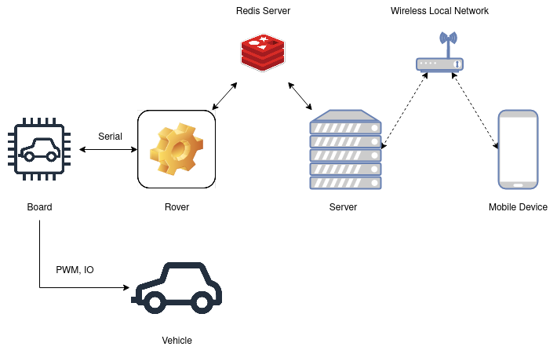

# Pedestrian Car 2 Project
This project is a new version of ```Pedestrian Car Project``` (https://github.com/Viriliter/PedestrianSlayer). Although the project name suggests that it is a continuation of the previous version, the new project is built from scratch, and features lots of new capabilities. The project's codebase is now far more well-constructed than its predecessor. 

## Getting Started
The project consists of 3 software branches: ```Rover```, ```Server```, and ```Board```. 

Each branch is in fact a different project, so it is easy to maintain the codebase and merge new changes without affecting other parts of the system. In this branch, there is no source code, and it is a summary of the project. Note that, this branch (```master```) should only be used as a template to create new branches. 

The following figure visualizes the branches of the project and their relationships with each other.  



### Rover
```Rover``` branch includes high-level logic drive control and algorithms like lane detection. The branch is written on Cpp, and it is targeted to run on a real-time Linux operating system. It schedules and executes all real-time processes and communicates with both the server program and board firmware, simultaneously.

### Server
```Server``` branch is a web interface that enables the user to control the vehicle. It uses Python-based Flask web framework. It mainly targets mobile devices so that it will be more intuitive to control the car. It also benefits from the device's orientation sensor and other onboard sensors to both control and monitor the vehicle. It eliminates the need of using any remote controller.

### Board
```Board``` is an interface between RC car hardware (DC motors and lights) and Raspberry Pi. Over serial communication, it executes simple tasks like generating PWM signals for corresponding motor controls. It also transmits the status of the vehicle to the single-board computer. 

## Prerequisites
### Hardware:
* Raspberry Pi 3
* Raspberry Pico
* Raspberry Pi Camera module or a web camera
* RC car chasis with DC motor and steering system
* UBlox Neo7 GNSS receiver
* Custom extension board for Raspberry Pi

### Software:
For more detailed information about the software requirements, follow the ```README.md``` file in each branch.

## Installing
Follow the installation procedures in ```README.md``` file of the corresponding branch. 

## Contributing
Not applicable

## Versioning
Not applicable

## Authors
Mert Limoncuoglu

## Acknowledgments
Not applicable

